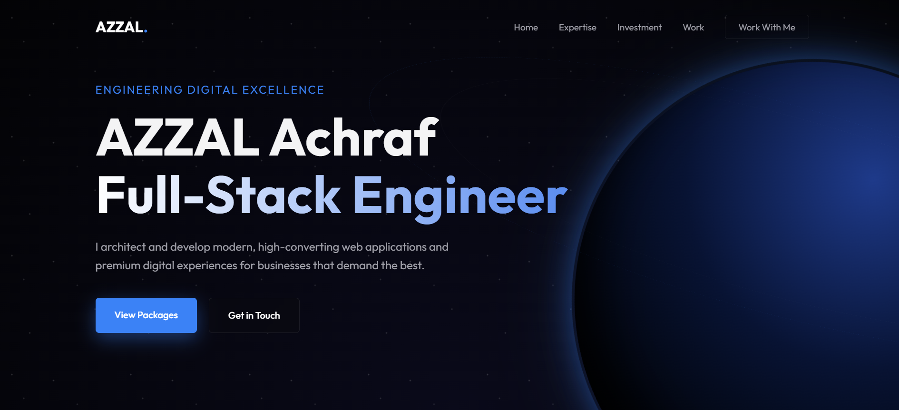

# Premium Subscription Landing Page

A modern and responsive landing page designed for digital subscription services and SaaS products.  
This project demonstrates a clean UI layout, modern web design principles, and a responsive structure suitable for startups and online businesses.

---

## Live Demo

🔗 https://azzalachraf.github.io/premium-subscription-landing-page/

---

## Preview

---

## Features

- Modern and minimal UI design
- Fully responsive layout
- Hero section with strong call-to-action
- Pricing / subscription plans section
- Smooth navigation experience
- Clean and structured HTML/CSS code

---

## Technologies Used

- HTML5
- CSS3
- JavaScript

---

## Project Structure

premium-subscription-landing-page
│
├── index.html
├── style.css
├── script.js
│
├── Preview
│   └── Homepage.png
│
└── README.md

---

## Purpose of the Project

This project was built as part of my web development portfolio to showcase the ability to design and develop modern landing pages for digital products and subscription-based services.

---

## Author

**Achraf Azzal**

Founder of Nexora Web Development  
Building modern websites and SaaS interfaces.

GitHub:  
https://github.com/azzalachraf

---

## License

This project is open source and available under the MIT License.
